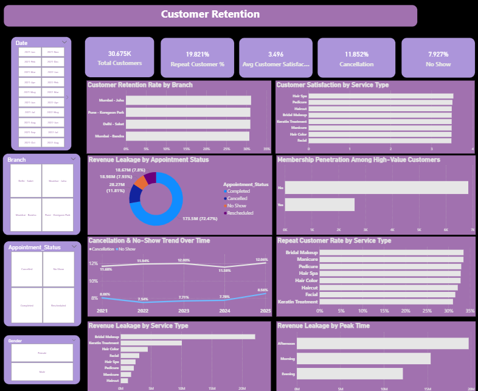

# Salon Business Analytics Dashboard
This project focuses on analyzing salon operations, customer behavior, revenue optimization, and revenue leakage using Python, SQL, and Power BI.

The dashboard was built to uncover operational inefficiencies, identify high-performing services and stylists, measure customer retention, and track business leakage caused by cancellations and no-shows.

The project combines business intelligence storytelling with operational analytics to simulate real-world decision-making for a multi-branch salon business.

# Business Problems Addressed

- Why are high appointments not fully translating into profit?
- Which services generate the highest revenue efficiency?
- Which stylists contribute the most to upselling and revenue?
- How much revenue is lost due to cancellations and no-shows?
- Are memberships attracting high-value customers?
- Which time slots drive maximum business activity?
- Which customer segments contribute most to retention?

# Key Business Insights

- ₹356M+ total revenue analyzed across salon operations
- ₹41.5M+ upsell revenue generated
- 37K+ appointments analyzed
- 25% high-value customers contributed significantly to overall revenue
- 50%+ repeat customer rate observed across branches
- 12%+ cancellation rate identified
- 8%+ no-show rate causing major revenue leakage
- Afternoon slots generated the highest appointment traffic
- Bridal Makeup and Keratin Treatment emerged as highly profitable services
- Premium stylists drove significantly higher upsell revenue
- Membership penetration among high-value customers uncovered strong loyalty trends

# Revenue Leakage Analysis

A major focus of this project was identifying operational revenue leakage.

The dashboard highlights:
- Revenue lost due to cancellations
- Revenue lost from no-shows
- Leakage trends over time
- Leakage by service type
- Leakage by appointment status
- Leakage during different peak hours

These insights can help management:
- optimize staffing
- reduce idle appointment slots
- improve scheduling efficiency
- improve customer retention strategies

# Customer Retention Analysis

The retention dashboard focuses on:
- Repeat customer trends
- Customer visit frequency
- Membership adoption
- High-value customer behavior
- Satisfaction trends across services
- Retention rates by branch

This helps identify:
- loyal customer segments
- profitable customer groups
- branches with stronger retention performance
- services with better customer stickiness

# Tools & Technologies Used

- Python
- Pandas
- NumPy
- Matplotlib
- Seaborn
- SQL
- MySQL
- Power BI
- DAX

# Dashboard Preview

## Salon Operations & Revenue Overview

## Customer Retention & Revenue Leakage Analysis

# Features Included

- Revenue trend analysis
- Stylist performance analysis
- Service profitability analysis
- Peak-hour business analysis
- Revenue leakage tracking
- Customer retention analysis
- Membership analysis
- Interactive slicers and KPI cards
- Multi-page executive dashboard design

---

# Outcome

The project demonstrates how business intelligence and analytics can be used to:
- improve operational efficiency
- optimize revenue generation
- identify hidden revenue leakage
- strengthen customer retention strategies
- support data-driven business decisions
